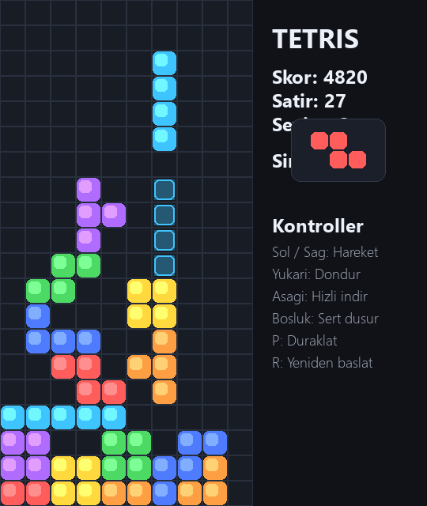

# Desktop Tetris

Python ve `pygame` ile hazirlanmis, Windows'ta tek tikla acilabilen masaustu Tetris oyunu.



## Ozellikler

- Pencere tabanli oynanis
- Sonraki parca gostergesi
- Ghost piece gorseli
- Skor, satir ve seviye takibi
- Duraklatma ve yeniden baslatma
- Kurulu Python gerektirmeden proje icinde paketlenmis `pygame`

## Calistirma

### Windows

Klasor icindeki `Tetris Oyna.cmd` dosyasina cift tiklaman yeterli.

### Python ile calistirma

```bash
python tetris.py
```

Not: Proje, `vendor/` altinda gerekli `pygame` dosyalarini da icerir.

## Kontroller

| Tus | Islev |
| --- | --- |
| Sol / Sag ok | Hareket |
| Yukari ok | Dondur |
| Asagi ok | Hizli indir |
| Bosluk | Sert dusur |
| P | Duraklat / devam et |
| R | Yeniden baslat |

## Proje Yapisi

```text
.
|- tetris.py
|- Tetris Oyna.cmd
|- vendor/
|- assets/
`- README.md
```

## Teknoloji

- Python 3
- pygame

## Lisans

Bu repo kisisel ve egitsel kullanim icin paylasilmistir.
